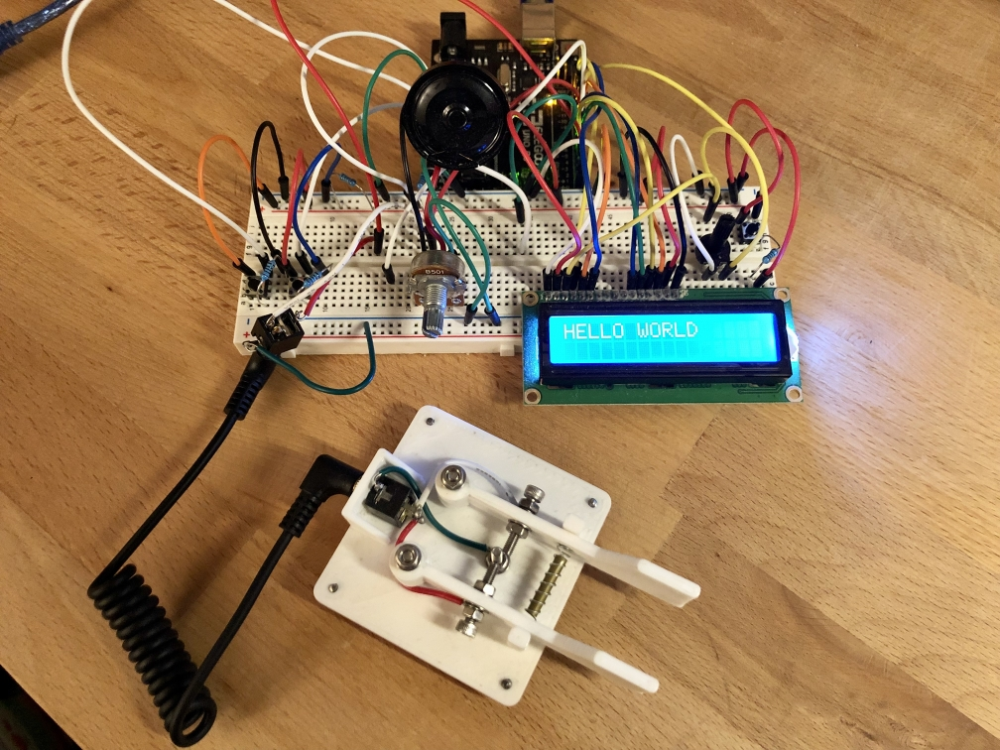

# CW-Practice-Tool
This is an Arduino sketch file that I created to go with an Arduino+Morse Code key setup I wired together. Perhaps I'll eventually upload a proper wiring diagram, but here's a picture of the setup:

A Morse key is plugged into the setup via an 3.5mm audio jack.

The setup includes:
* Speaker
* 16x2 LCD Display
* Potentiometers (Speaker volume, LCD contrast)
* Buttons (Options cycling and changing)

Multiple options are available, including Pitch, Speed, and even Key Type (e.g. Single lever, Iambic Key A/B, Sideswiper, etc.).

This was my first time working with electronic components and coding the software to run on it. It was a great learning experience, and lots of fun!